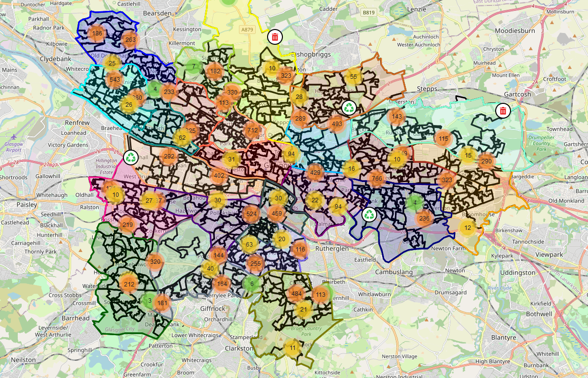

An interactive visualisation of litter on the streets of Glasgow City. It formed part of a research project which aimed to discover the relationships between deprivation and litter.

Here is the conclusion from research project's [executive summary](https://github.com/Garee/glasgow-litter/blob/main/report/executive-summary.pdf):

> None of the potential explanatory deprivation indicators were statistically significant. For this reason, no single
> area of focus could be recommended to reduce littering. However, it was acknowledged that insights may be
> gained by removing certain limiting factors to improve the methods used. By using increased quantities of
> hardware resources and high-resolution images over time, local organisations may be able to use the resulting
> insights to make informed policy decisions.
> The feasibility of using an automated approach to count litter on a city scale was confirmed. By successfully
> applying object detection to 37,300 street view images, it was established that the approach has the potential
> to not only be scaled up within Glasgow City, but also to other locations within Scotland

