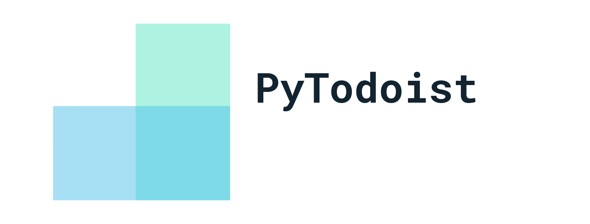
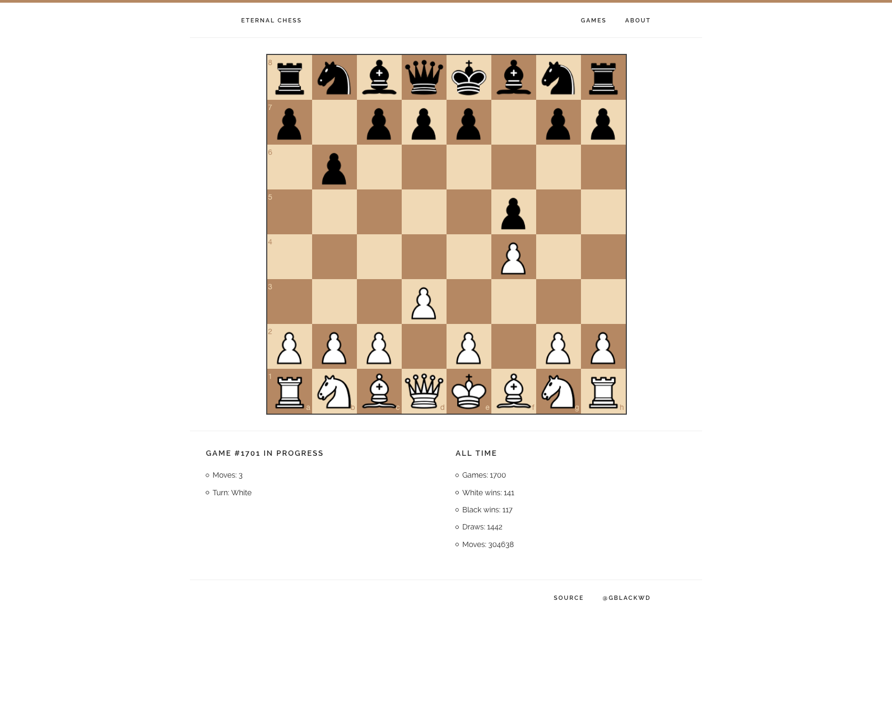

## PyTodoist

[PyTodoist](https://github.com/Garee/pytodoist) is a Python package for interacting with [Todoist](https://todoist.com). It hides the underlying API calls with higher-level abstractions that make it easy to use Todoist with Python.

## sp

[sp](https://github.com/Garee/sp) is a command line utility to search Startpage.com from the terminal.

## Eternal Chess

[Eternal Chess](https://github.com/Garee/eternalchess.com) is a website that displays a never-ending chess match between two API opponents.

View the website [here](http://eternalchess.garyblackwood.co.uk).
